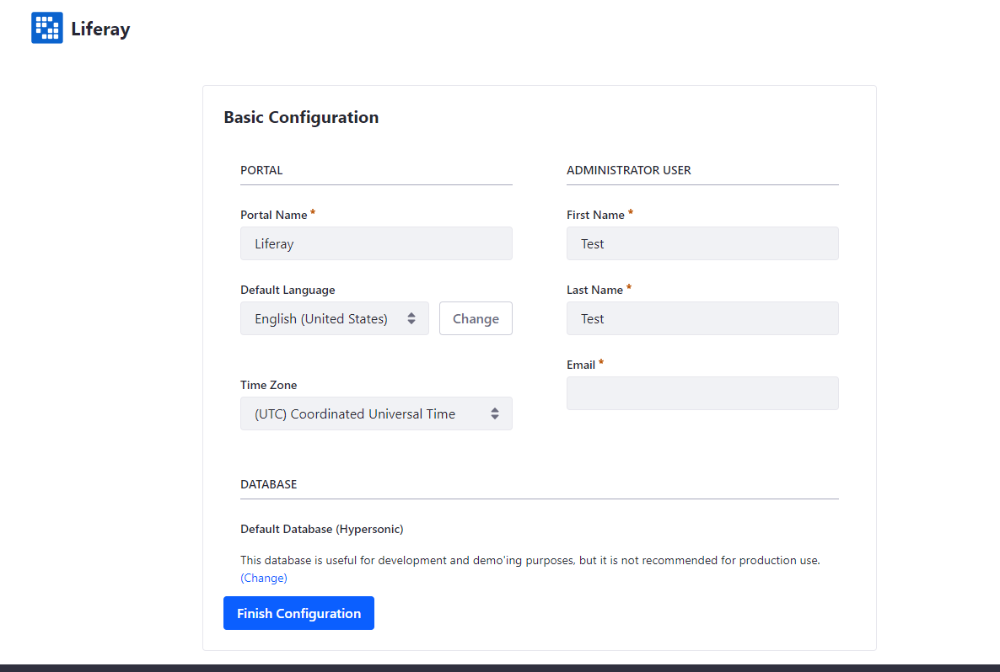
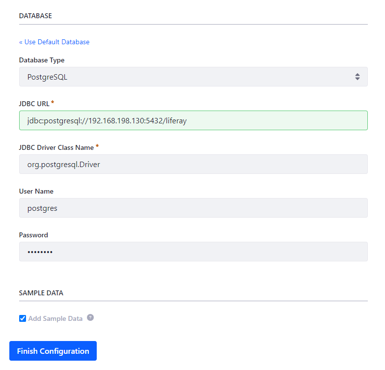
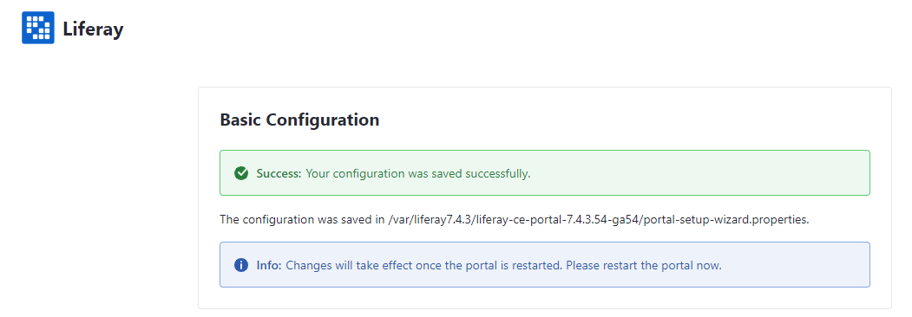
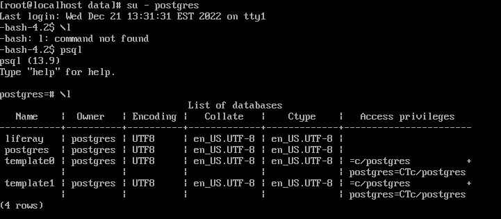
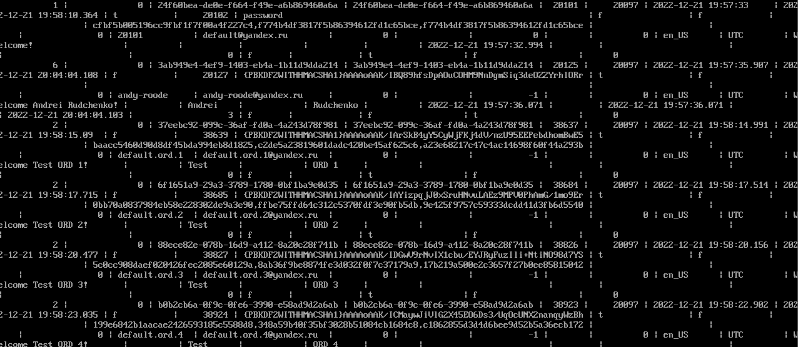

# Installing the Liferay portal

Below you can find the steps how to setup the Liferay portal that works with Postgres13 database.

Prerequisites:
Install the Ansible package to your Ubuntu Linux using the CLI commands below:
```
sudo apt-add-repository ppa: ansible/ansible
sudo apt-get update
sudo apt-get install ansible
```


Execution steps:
1. Clone the Ansible repository with command:
```
git clone git@git.netcracker.com:anru0718/devopslearn.git
```
2. Navigate to Ansible/host_vars folder. Provide the ip-addresses for db_server and web_server.
3. Execute the ansible playbook to setup the Postgres13 (CentOS 7):
```
ansible-playbook playbooks/InstallPostgres13.yml --ask-vault-pass (vault password: zzz)
```
4. Execute the ansible playbook to install the Liferay portal (Ubuntu Server):
```
ansible-playbook playbooks/InstallLifeRay.yml --ask-vault-pass (vault password: zzz)
```
5. Once the deployment steps are executed, please perform the checks:
     - Navigate to `web_server_ip:8080`. You will see Basic Configuration page. It is already have the info to create the test user, you just need to add e-mail. 

     - Setup the database connection. Click on Change button in Database section. In Database Type please select PostgreSQL. Then fill other parameters that you used during the setup of PostgreSQL13. After you entered all values, click on Finish Configuration. 

     - Once it's done, Liferay will ask you to restart the portal. 
        * Connect to web_server by SSH
        * Navigate to `/var/liferay7.4.3/liferay-ce-portal-7.4.3.54-ga54/tomcat-9.0.68/bin`
        * execute `./shutdown.sh stop`
        * execute `./startup.sh start`

     - After you restarted the Portal you will see Welcome screen. 
     - Now you need to check the database, how it works.
        * Connect to db_server by SSH.
        * Connect to postgres db by created user: `su - postgres`
        * Then type `psql`. Check the list of databases using command `\l`.
        * Using command `\c liferay` connect to liferay database. 
        * Perform the query `select * from user_;`. It will return the created values. 

6. Liferay is successfully created.