Отчёт о выполнении заданий по Jenkins.

Данный отчёт содержит в себе информацию о выполнении заданий:
```
1. Create an Jenkins Shared Library which provides methods to install Liferay. This methods should be parametrized, f.e. install_liferay(server_ip, liferay_login, liferay_password) and should launch your Ansible script.

3. Declarative pipeline which starts Liferay installation (using ansible script)
4. Parametrized pipeline which can run 1 and 2 pipelines in case of checked checkboxes.
```

Работа над заданием 2 в процессе.


1. Подготовка к использованию Jenkins.
    - Наличие Ubuntu-сервера.
    - Установка Java на Ubuntu-сервер командой `sudo apt install default-jre`
    - Установка Jenkins на Ubuntu-сервер:
    ```
   wget -q -O - https://pkg.jenkins.io/debian-stable/jenkins.io.key | sudo apt-key add -
   sudo sh -c 'echo deb http://pkg.jenkins.io/debian-stable binary/ > /etc/apt/sources.list.d/jenkins.list'
   sudo apt update
   sudo apt install jenkins -y
   sudo systemctl start jenkins
    ```
    - Установка Git на Ubuntu-сервер командой `sudo apt install git`
    - Установка Ansible на Ubuntu-сервер:
    ```
    sudo apt-add-repository ppa: ansible/ansible
    sudo apt-get update
    sudo apt-get install ansible
    ```

2. Первоначальная настройка Jenkins.
    - Открываем Jenkins по адресу `localhost:8080`, если заходим непосредственно c Ubuntu-сервера, или `jenkins_ip_address:8080`, если заходим из вне.
    - Создаём базового админ-юзера.
    - В силу того, что мы будем использовать Ansible playbooks, проинсталлируем Ansible плагин:
        * Из главной страницы Jenkins переходим в меню Manage Jenkins
        * Находим и переходим в раздел Manage Plugins
        * В доступном списке опций кликаем на Available Plugins и в поисковике ищем Ansible. 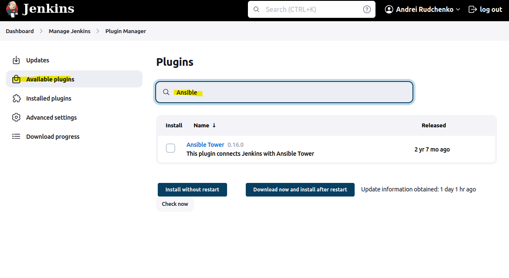
        * Выбираем Ansible, далее кликаем на Install without restart.
        * Для проверки наличия установленного Ansible переходим в Installed plugins и ищем Ansible. 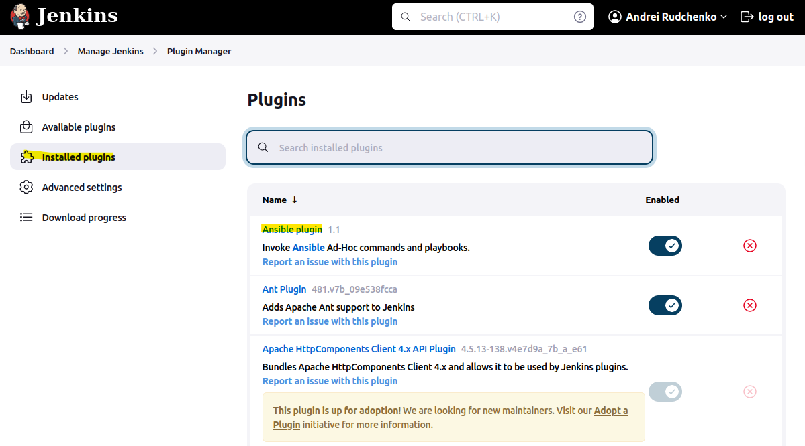
        * Далее необходимо сконфигурировать модуль Ansible. Переходим на главный экран Jenkins, затем в Manage Jenkins.
        * Переходим в Global Tools Configuration. 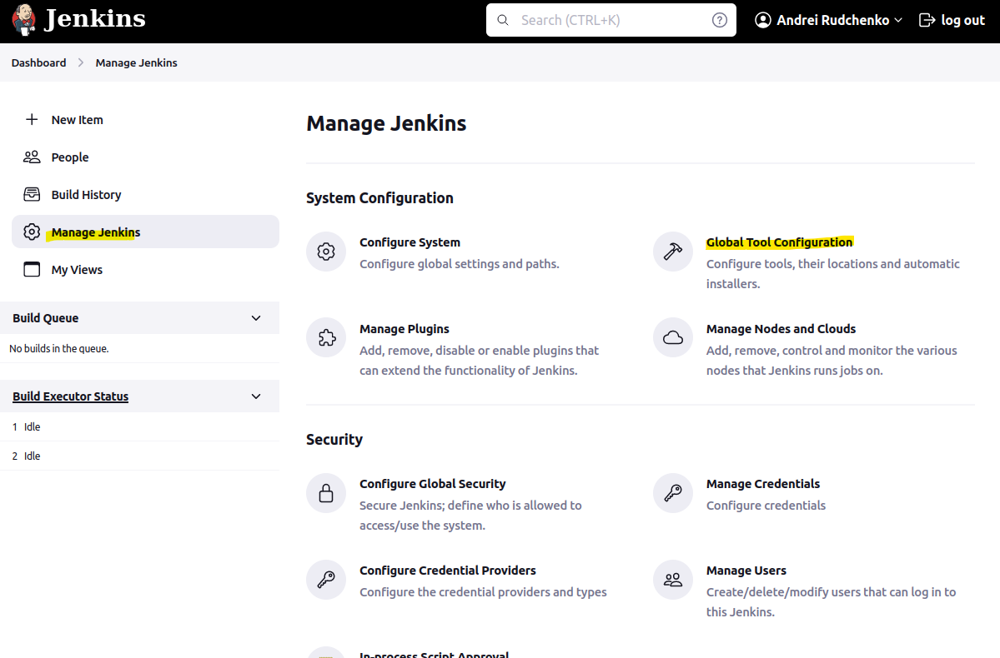
        * Листаем вниз пока не найдем Ansible. Кликаем на Add Ansible. Вводим параметры Name и Path to ansible executables directory. Нажимаем Save. 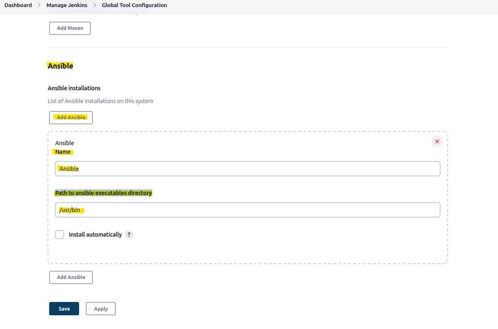
    - Для выполнения задания №1 используется Jenkins Shared Library. Установим подключение:
        * С главной страницы Jenkins переходим в Manage Jenkins, затем в Configure System. 
        * Листаем страничку вниз до тех пор пока не увидим Global Pipeline Libraries. Используя имеющийся подготовленный репозиторий, установим подключение. 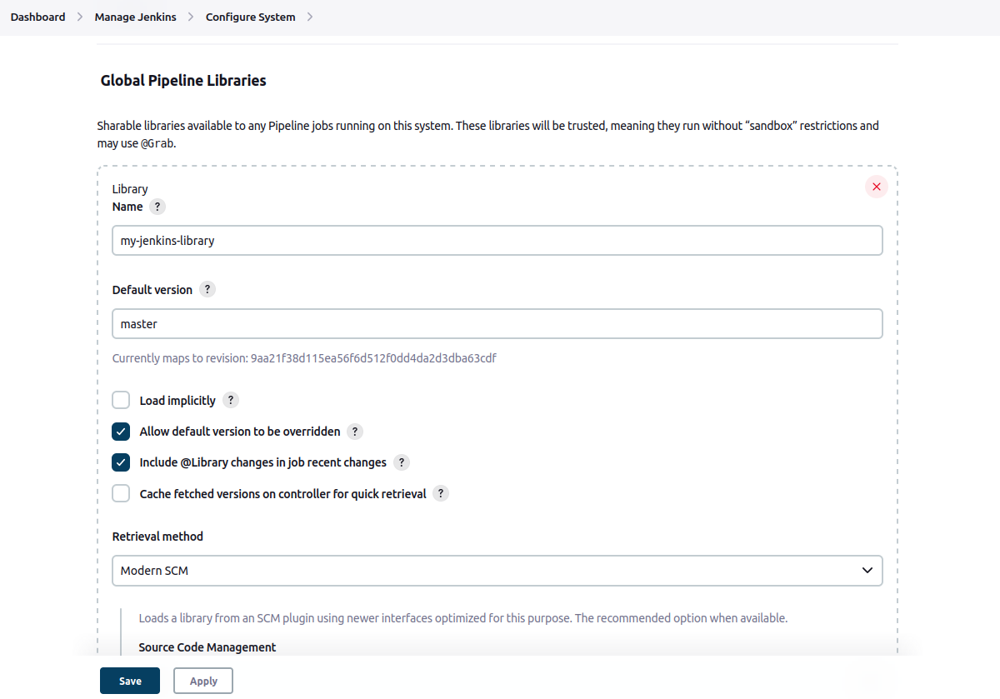 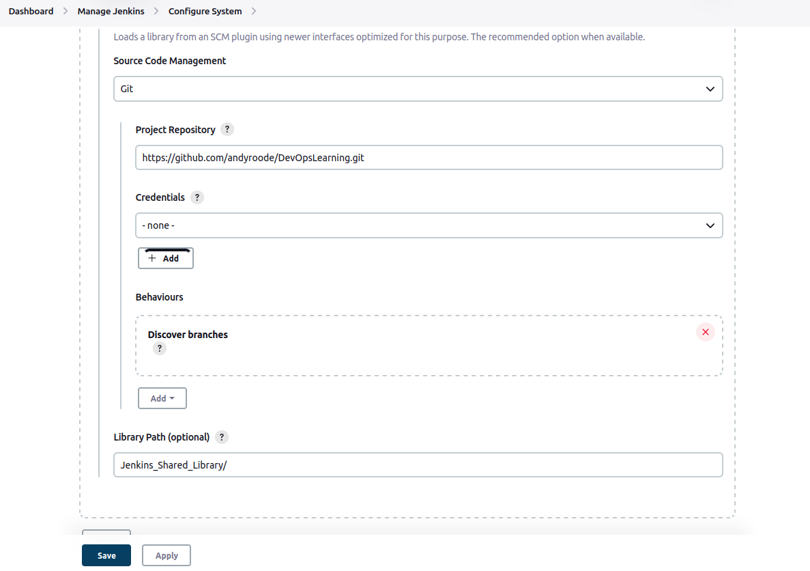 
        * Настройка необходимого функционала завершена. Можно переходить к созданию pipeline-job для выполнения задания №1.

3. Создание Pipeline-Job в Jenkins.
    - На главном экране Jenkins нажимаем New Item. Откроется окно с опциями. 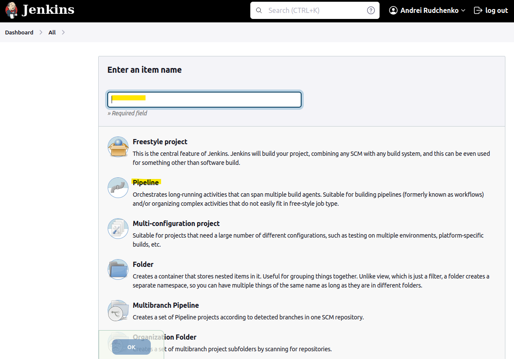
    - Введём название нашей Job, выбираем опцию Pipeline, нажимаем Ok. Откроется окно с параметрами. 
    - Данный pipeline использует input-параметры и параметризованные методы, которые описаны в Shared Library. 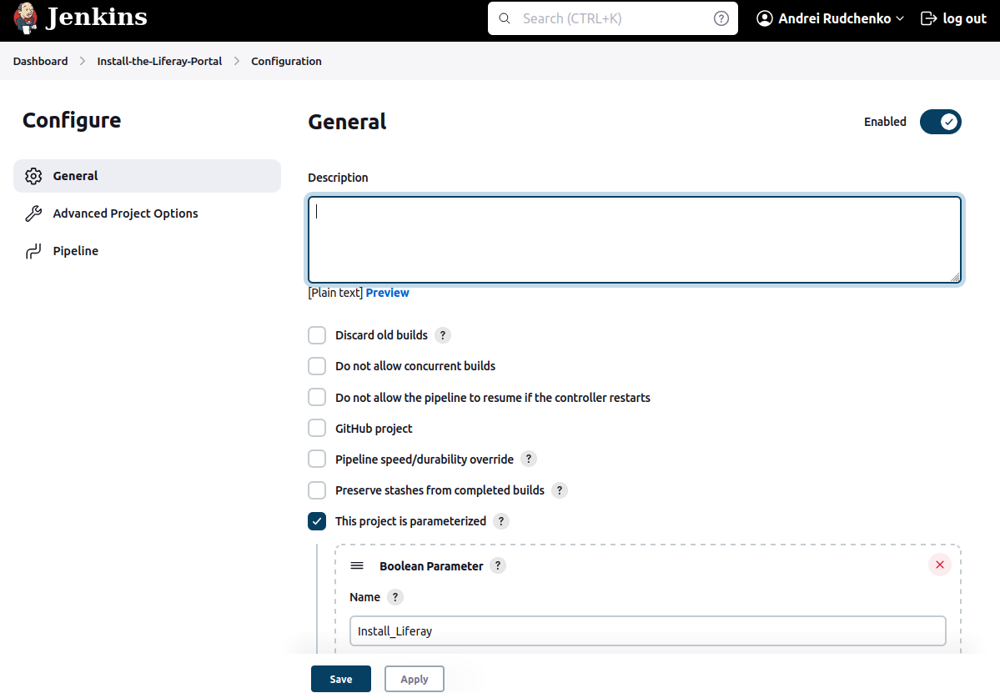 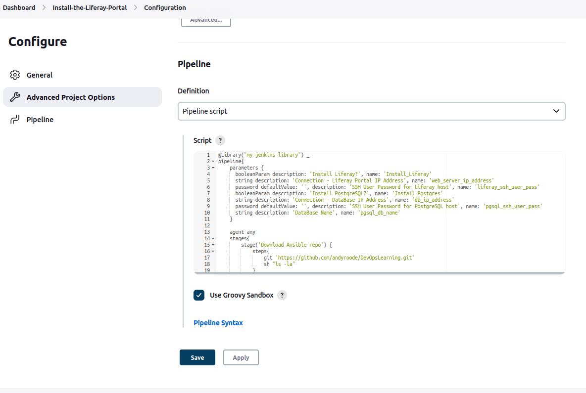
    - Ниже приведён декларативный синтаксис для pipeline:
    ```
    @Library("my-jenkins-library") _ 
    pipeline{
        parameters {
        booleanParam description: 'Install Liferay?', name: 'Install_Liferay'
        string description: 'Connection - Liferay Portal IP Address', name: 'web_server_ip_address'
        password defaultValue: '', description: 'SSH User Password for Liferay host', name: 'liferay_ssh_user_pass'
        booleanParam description: 'Install PostgreSQL?', name: 'Install_Postgres'
        string description: 'Connection - DataBase IP Address', name: 'db_ip_address'
        password defaultValue: '', description: 'SSH User Password for PostgreSQL host', name: 'pgsql_ssh_user_pass'
        string description: 'DataBase Name', name: 'pgsql_db_name'
        }

        agent any
        stages{
            stage('Download Ansible repo') {
                steps{
                    git 'https://github.com/andyroode/DevOpsLearning.git'
                    sh "ls -la"
                }
            }
            stage('Install PostgreSQL-13'){
                when{
                    expression {Install_Postgres == 'true'}
                }
                steps{
                    install_PostgreSQL(db_ip_address:db_ip_address,pgsql_db_name:pgsql_db_name,db_ssh_pass:pgsql_ssh_user_pass)
                }
            }
            stage('Install Liferay Portal'){
                when{
                    expression {Install_Liferay == 'true'}
                }
                steps{
                    install_Liferay(web_server_ip_address:web_server_ip_address,liferay_ssh_user_pass:liferay_ssh_user_pass)
                }
            }
        }
    }
    ```
    - Дам комментарии по коду:
        * `@Library("my-jenkins-library") _` - использование подключённой библиотеки
        * Создание параметров, которые будем вводить вручную:
        ```
        parameters {
        booleanParam description: 'Install Liferay?', name: 'Install_Liferay'
        string description: 'Connection - Liferay Portal IP Address', name: 'web_server_ip_address'
        password defaultValue: '', description: 'SSH User Password for Liferay host', name: 'liferay_ssh_user_pass'
        booleanParam description: 'Install PostgreSQL?', name: 'Install_Postgres'
        string description: 'Connection - DataBase IP Address', name: 'db_ip_address'
        password defaultValue: '', description: 'SSH User Password for PostgreSQL host', name: 'pgsql_ssh_user_pass'
        string description: 'DataBase Name', name: 'pgsql_db_name'
        ``` 
        * `stage('Install PostgreSQL-13'){` - создание этапов нашего pipeline. То есть мы будем выполнять этапы один за другим. Сначала скачиваем репозиторий, потом ставим базу, потом портал. 
        * `git 'https://github.com/andyroode/DevOpsLearning.git'` - при помощи метода git скачиваем репозиторий с Ansible playbooks.
        * Блок when необходим для определения когда мы будем выполнять stage. В данном случае этапы установки базы и портала будут выполняться, если пользователь выбрал эти установки.
        ```
        when{
                expression {Install_Postgres == 'true'}
            }
        ```
        * steps - те действия которые будут выполнены на текущем этапе pipeline
        ```
        steps{
                install_PostgreSQL(db_ip_address:db_ip_address,pgsql_db_name:pgsql_db_name,db_ssh_pass:pgsql_ssh_user_pass)
            }
        ```
        * Внутри steps я использую методы, описанные в созданной Jenkins Shared Library
        ```
        install_PostgreSQL(db_ip_address:db_ip_address,pgsql_db_name:pgsql_db_name,db_ssh_pass:pgsql_ssh_user_pass)
        ```
    
    - Немного расскажу о параметризованных методах, которые находятся в Shared Library:
        * Прежде всего стоит сказать о Jenkins Shared Library. Данный функционал удобен, когда есть множество pipeline, которые делают одни и те же действия. Соответственно будет удобно написать код единожды и использовать его по необходимости где угодно. Отсюда и название - Shared Library.
        * Jenkins Shared Library использует определённую структуру папок:
            - vars
            - src
            - resources
        * Написанные мной методы лежат в папке vars.
        * С точки зрения Jenkins, файл из папки vars и есть метод. То есть, как было указано выше, я вызываю метод install_PostgreSQL. В Shared library он хранится как файл install_PostgreSQL.groovy.
        * Код данного метода выглядит следующим образом:
        ```
        def call (Map config = [:]){
            sh "sed -i 's/db_ip_address/$config.db_ip_address/g' ${pwd}/workspace/${JOB_NAME}/Ansible_for_Jenkins/host_vars/db_server.yaml"
            sh "sed -i 's/pgsql_db_name/$config.pgsql_db_name/g' ${pwd}/workspace/${JOB_NAME}/Ansible_for_Jenkins/host_vars/db_server.yaml"
            sh "sed -i 's/db_ssh_pass/$config.db_ssh_pass/g' ${pwd}/workspace/${JOB_NAME}/Ansible_for_Jenkins/host_vars/db_server.yaml"
            ansiblePlaybook disableHostKeyChecking: true, installation: 'Ansible', inventory: 'Ansible_for_Jenkins/hosts', playbook: 'Ansible_for_Jenkins/InstallPostgres13.yml'
        }
        ```
        * Комментарии о коде:
            - `sh "sed -i 's/db_ip_address/$config.db_ip_address/g' ${pwd}/workspace/${JOB_NAME}/Ansible_for_Jenkins/host_vars/db_server.yaml"` - делаю замену части строки на введённый ip адрес. (условие поставленной задачи - вводить адрес хоста вручную). Введённый ip адрес будет сохранен в файле db_server.yaml, который будет использоваться модулем Ansible.
            - `ansiblePlaybook disableHostKeyChecking: true, installation: 'Ansible', inventory: 'Ansible_for_Jenkins/hosts', playbook: 'Ansible_for_Jenkins/InstallPostgres13.yml'` - выполнение Ansible playbook плагином Ansible, который я устанавливал при подготовке Jenkins.
            - Весь код можно посмотреть в папке Jenkins_Shared_Library/vars/

    - После того, как мы написали код, выбрали нужные параметры pipeline, нажимаем Apply, затем Save. Pipeline-Job создан. 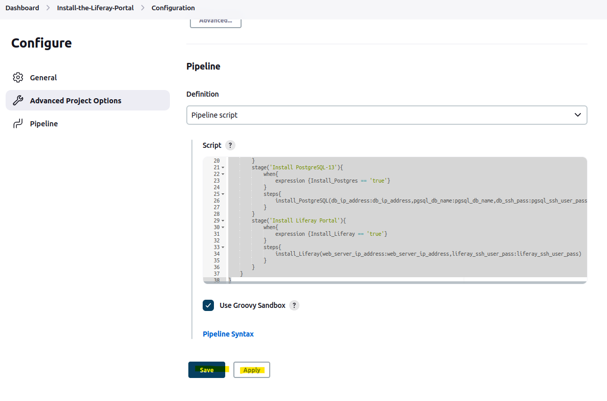

4. Запуск созданного pipeline в Jenkins.
    - Когда мы создали pipeline, он отображается на главном экране Jenkins: 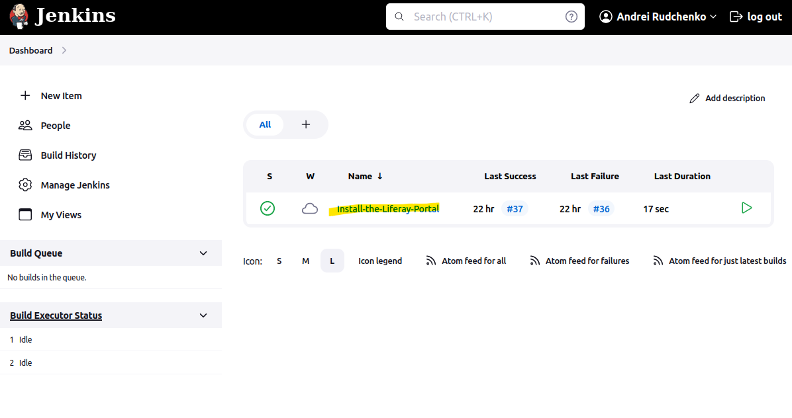
    - Зайдем на созданный pipeline, затем нажимаем на Build with parameters: 
    - Введём необходимые параметры и нажмём build: 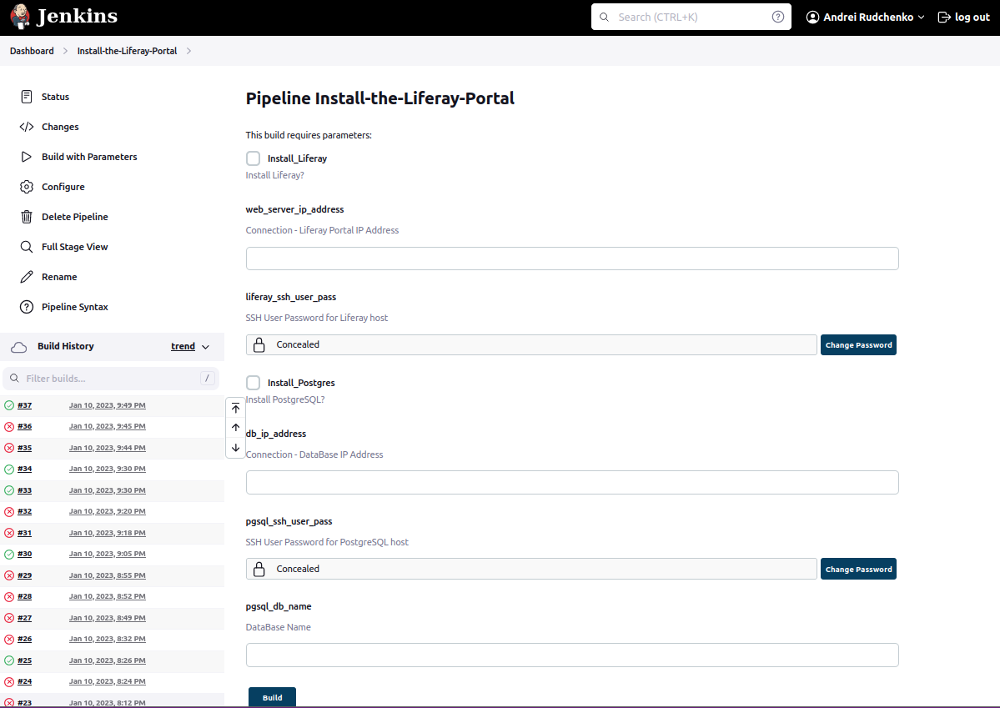 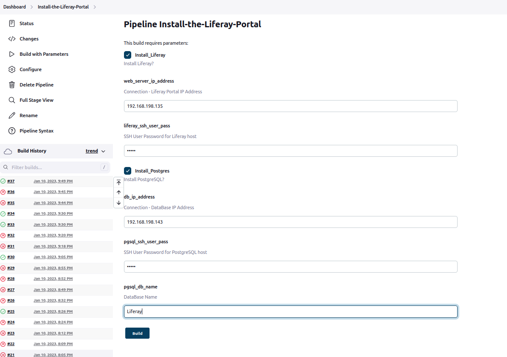 
    - Проверим, как успешно отработал созданный pipeline:
        * Первый шаг - скачивание репозитория и отображение структуры каталога: 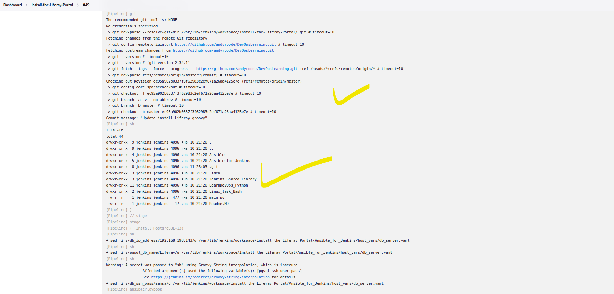 
        * Второй шаг - установка базы данных PostgreSQL-13: 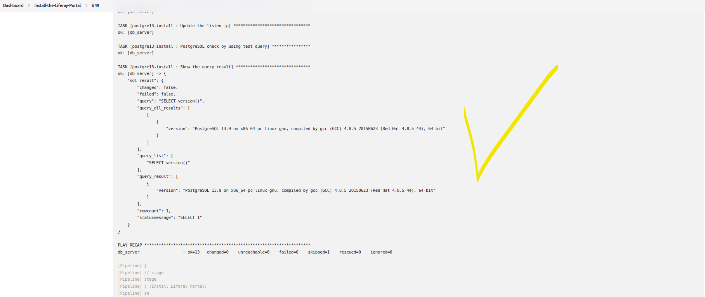
        * Третий шаг - установка портала Liferay: 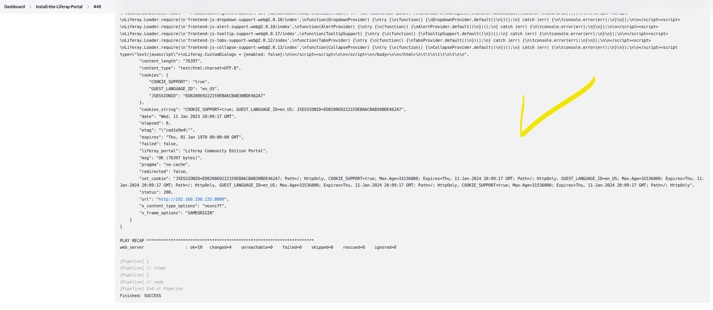
        * Из скриншотов выше видно, что были сделаны коллы для проверки установленных пакетов. Перейдем на хост с установленным порталом и видим, что...  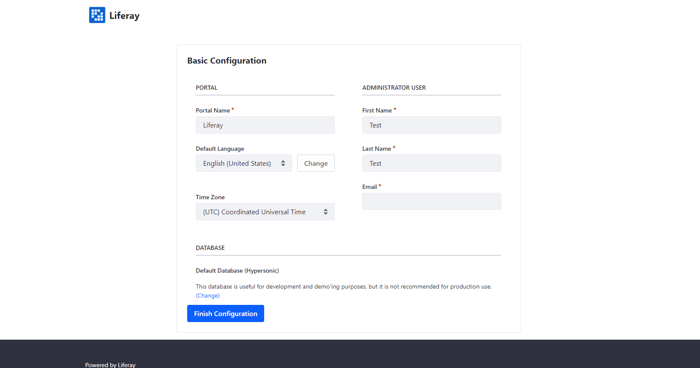


Таким образом, мною был установлен портал с подключением к базе, используя технологии Jenkins + Ansible + Git.


Выполнение задания №2 "Scripting pipeline which starts PostgreSQL installation (using ansible script)"
Суть данного задания продемонстрировать скриптовый pipeline.

1. Создадим новый item с типом pipeline. В опциях укажем "This project is parameterized". 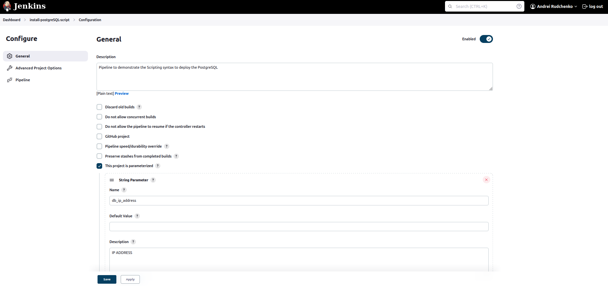
2. Добавим строковые переменные, которые будем использовать в нашем pipeline. 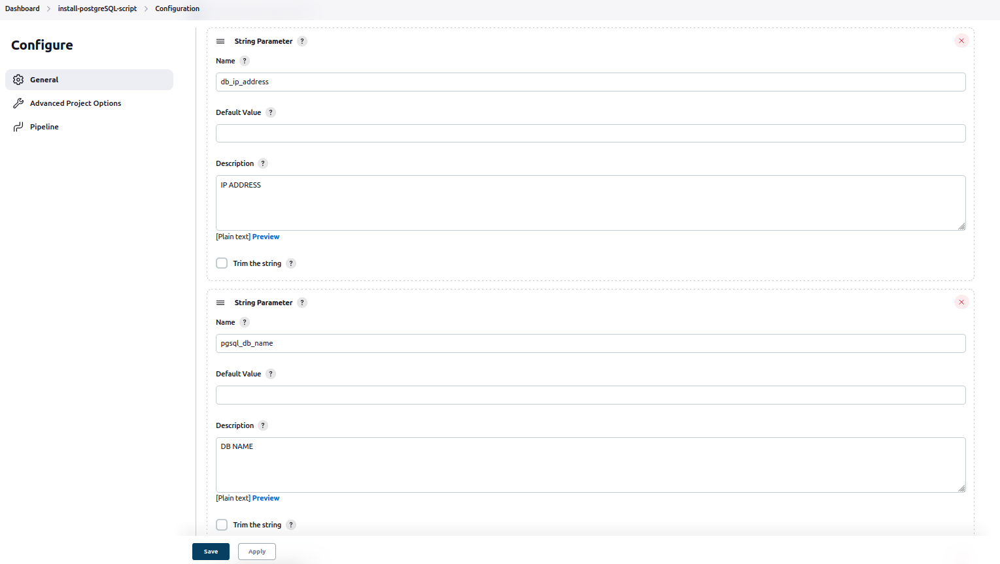
3. В поле Pipeline добавим следующий скрипт:
```
node {
    stage('Download Ansible repo') {
        git 'https://github.com/andyroode/DevOpsLearning.git'
        sh "ls -la"
    }
    stage('Install PostgreSQL-13') {
        sh "sed -i 's/db_ip_address/$db_ip_address/g' ${pwd}/workspace/${JOB_NAME}/Ansible_for_Jenkins/host_vars/db_server.yaml"
        sh "sed -i 's/pgsql_db_name/$pgsql_db_name/g' ${pwd}/workspace/${JOB_NAME}/Ansible_for_Jenkins/host_vars/db_server.yaml"
        sh "sed -i 's/db_ssh_pass/$db_ssh_pass/g' ${pwd}/workspace/${JOB_NAME}/Ansible_for_Jenkins/host_vars/db_server.yaml"
        ansiblePlaybook disableHostKeyChecking: true, installation: 'Ansible', inventory: 'Ansible_for_Jenkins/hosts', playbook: 'Ansible_for_Jenkins/InstallPostgres13.yml'
    }
    
}
```
4. Некоторые пояснения по скрипту:
    - `stage('Download Ansible repo') {` - этап внутри нашего pipeline.
    - В отличие от декларативного синтаксиса, в скриптовом не пишем step:
    ```
   stage('Download Ansible repo') {
        git 'https://github.com/andyroode/DevOpsLearning.git'
        sh "ls -la"
    }
    ```
    - Второй шаг pipeline содержит linux команды для замены текста и команду для выполнения ansible-playbook. Также стоит обратить внимание, что внутри linux команд используются объявленные ранее строковые переменные.
    ```
    stage('Install PostgreSQL-13') {
        sh "sed -i 's/db_ip_address/$db_ip_address/g' ${pwd}/workspace/${JOB_NAME}/Ansible_for_Jenkins/host_vars/db_server.yaml"
        sh "sed -i 's/pgsql_db_name/$pgsql_db_name/g' ${pwd}/workspace/${JOB_NAME}/Ansible_for_Jenkins/host_vars/db_server.yaml"
        sh "sed -i 's/db_ssh_pass/$db_ssh_pass/g' ${pwd}/workspace/${JOB_NAME}/Ansible_for_Jenkins/host_vars/db_server.yaml"
        ansiblePlaybook disableHostKeyChecking: true, installation: 'Ansible', inventory: 'Ansible_for_Jenkins/hosts', playbook: 'Ansible_for_Jenkins/InstallPostgres13.yml'
    }
    ```

5. Сохраняем и запускаем наш pipeline. 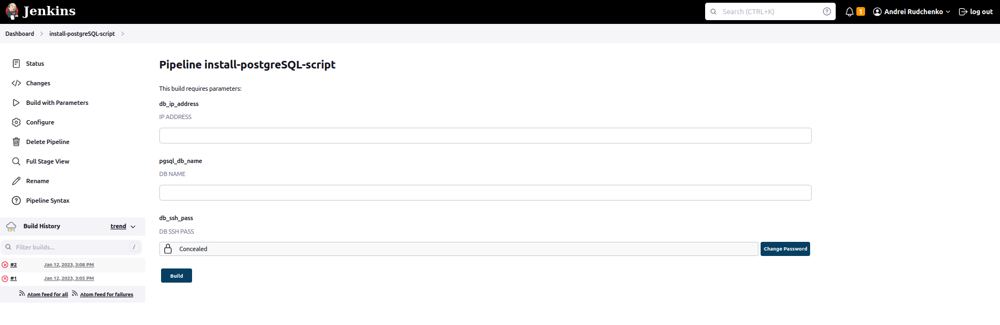
6. Введём необходимые параметры и нажимаем Build. 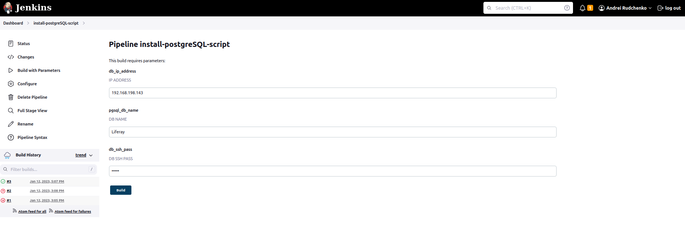
7. Посмотрим статус выполнения pipeline. 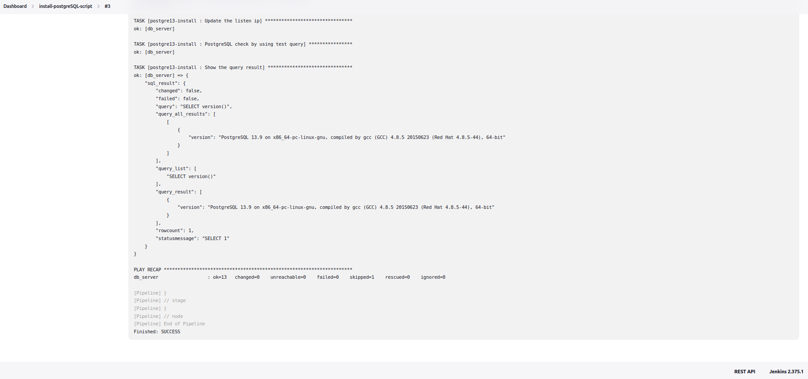
8. Pipeline успешно выполнил работу.